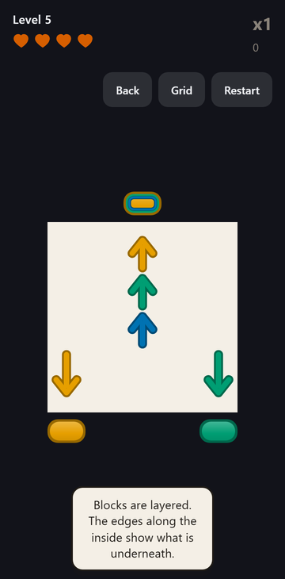
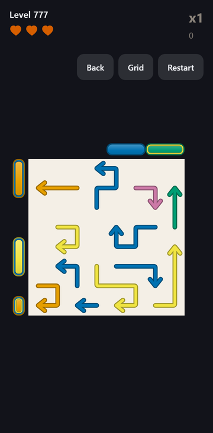

# Arrow Crack 🏹

A tap-only puzzle game. A tangle of long, bent, colored arrows fills a grid,
and a frame of layered, breakable blocks surrounds it. Tap an arrow and it
slides out along its own path, head first, into the block on its lane — fire
them in the right order to break every block. Tapping a blocked arrow or
hitting the wrong color costs a heart, and hearts are all you have.

**▶ Play it in your browser: <https://eren-ozcan.github.io/arrow-crack/>** — no
install, no account, progress saved in the browser.

On Android it is not on the Play Store yet. Store title: **Arrow Crack Arrow
Pop Puzzle**, package `com.yilkgames.arrowcrack`.

<p align="center">
  
  
  
</p>

## What you actually do

- **Read the tangle.** Every arrow leaves along its own body, so the order
  matters: an arrow is free only when nothing lies on its path out.
- **Match the block.** An arrow peels the top layer of the block on its lane
  if the colors match. The wrong color bounces back and costs a heart.
- **Break the frame.** Blocks are layered, and the inner edge shows what is
  underneath. Wide blocks span several lanes; any of them can peel it.
- **Use the specials.** A Joker takes any color, a Bomb peels its block and
  both neighbours, a Ghost fires straight through the tangle.
- **Keep the chain.** Stars come from how few mistakes you made. Score comes
  from a combo chain that speed raises only while it is unbroken.
- **Play 2000 levels.** A ten-level tutorial, one-heart levels, timed levels
  where a mistake costs seconds, and four hand-shaped silhouette boards at
  20, 40, 60 and 80.

Stuck is never a trap: the solver notices a board that can no longer be
cleared and offers a free restart, and a hint is the solver's next move.

## The demo

The link above is the production web build of `master`, published by
`.github/workflows/demo.yml`. It is the same code the Android app runs; the
only difference is what the browser does not have:

- **No ads and no purchases.** The ad, purchase and analytics services talk
  to a native driver, and the browser has none, so they report themselves
  unavailable. The rewarded buttons are never offered and nothing is sent
  anywhere.
- **Saves live in `localStorage`.** Clearing site data resets progress.
- **No Android back button or audio focus.** Both are native plugins and are
  skipped on the web.

Everything else — every level, the solver, the hints, the specials, the
colour-blind mode and the synthesised sound — is the real thing.

---

# Building it

Requires Node 22+.

```sh
npm install
npm run dev              # dev server at localhost:5173
npm run build            # production web build into dist/
npm test                 # unit tests (vitest)
npm run typecheck        # tsc only
npm run levels:validate  # the level gate every shipped level passes
npm run android:dev      # build, sync and run on a device
```

The three images at the top are `npm run art:shoot` stills (levels 5 and 777,
the last with `--colour-blind`) at a 360dp phone, cropped and halved. They are
the only marketing-type images in this repo; store artwork stays out of it
(see `CLAUDE.md`).

## Tech stack

- TypeScript + Vite, the board drawn on a 2D canvas with no sprites
- [Capacitor 7](https://capacitorjs.com/) for the Android shell
- An IDA\* solver in a Web Worker, shared by the generator, CI and the app
- WebAudio synthesis for every sound effect
- Vitest, with a 100% coverage gate on the engine and the solver

## Where things live

| Area                               | Files                               |
| ---------------------------------- | ----------------------------------- |
| Rules (a pure reducer)             | `src/engine/`                       |
| Solver, stuck check and hint       | `src/solver/`                       |
| Level generator and per-level spec | `src/generator/`                    |
| Level data and the loader          | `src/levels/`                       |
| Session, clock and score           | `src/game/`                         |
| Canvas drawing                     | `src/render/`                       |
| Gestures                           | `src/input/`                        |
| Sound                              | `src/audio/`                        |
| Screens and strings                | `src/ui/`, `src/ui/strings.en.json` |
| Local save                         | `src/state/`                        |
| Ads, purchases, analytics facades  | `src/services/`                     |
| Level tooling (run through `tsx`)  | `tools/`                            |

## Planning documents

| File                                  | What it decides                                                                                                                      |
| ------------------------------------- | ------------------------------------------------------------------------------------------------------------------------------------ |
| [DESIGN.md](docs/DESIGN.md)           | Rules, lives, scoring, dead states, data model, level generation, architecture                                                       |
| [ROADMAP.md](docs/ROADMAP.md)         | Milestones 0-9 and their done-conditions, plus the explicit non-goals                                                                |
| [PROGRESSION.md](docs/PROGRESSION.md) | Score and combo multiplier, praise and celebration, timed and one-heart levels, the hint economy, and what leagues need recorded now |
| [ART.md](docs/ART.md)                 | Visual direction, the colorblind-safe palette and glyph system, states, motion, validation tests                                     |
| [AUDIO.md](docs/AUDIO.md)             | The cue set, the combo pitch ladder, mixing and platform rules                                                                       |
| [STORE.md](docs/STORE.md)             | Listing identity, short and long description, ASO, screenshots, data safety, review replies                                          |
| [ADS.md](docs/ADS.md)                 | Ad formats, triggers, caps, consent, IAP — bound by the studio-wide `pictures/ADS_POLICY.md`                                         |
| [TELEMETRY.md](docs/TELEMETRY.md)     | Level delivery and remote override, analytics event schema, the difficulty retuning loop, performance budgets                        |
| [CI.md](docs/CI.md)                   | What runs in CI, the level validation gate, the local release procedure, signing and keystore backup                                 |
| [REFERENCE.md](docs/REFERENCE.md)     | Amaze GO teardown (100M+ installs, 4.5/241K, no remove-ads IAP) — listing data, what we take, what we refuse, and the three wedges   |

## The four rules everything else follows from

1. **Hearts are the only currency.** No move limit. **Tapping the wrong arrow
   costs a heart** — whether it was blocked or the wrong color, at every
   level, with no grace tap. Levels grant 4, then 3 from level 50, and a
   designated few grant exactly 1.
2. **Readability is the difficulty curve.** Hearts are spent on misreads, so
   any visual choice that trades legibility for mood loses.
3. **Stars and score are separate.** Stars come from mistakes and gate
   progression; score comes from a combo chain and gates nothing. Speed
   raises the multiplier only while the chain is unbroken, so haste never
   beats accuracy.
4. **The solver is shared.** One search powers the generator, the CI
   validation gate, the in-app stuck detection, the hint, and the remote
   override check.
